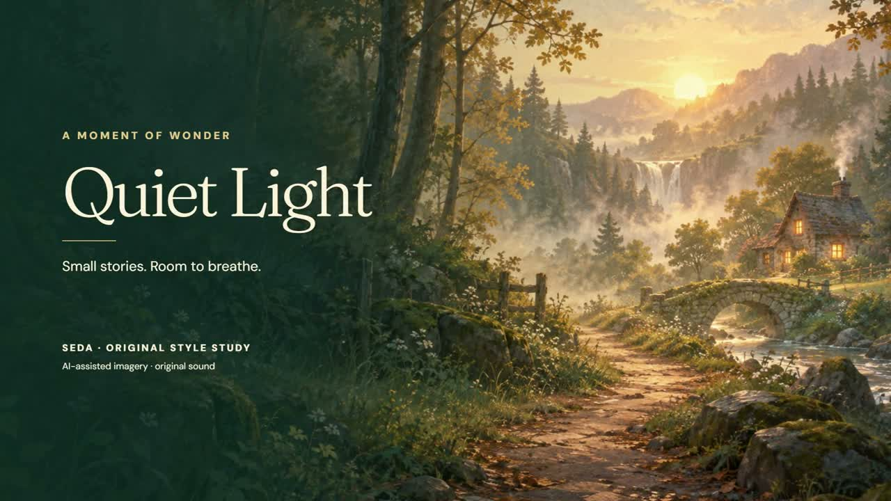
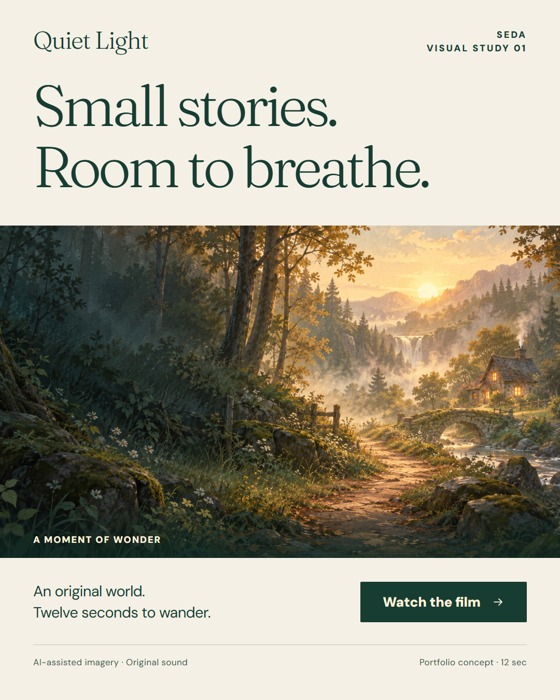

# Quiet Light — motion and static visual study

[Watch / download the 12-second video (MP4, 2.1 MB)](https://raw.githubusercontent.com/449693691/quickfix-desk-demos/main/atmospheric-video-demo/quiet-light-720p.mp4)

[View the portrait advertisement (1080×1350 PNG, 1.3 MB)](static-ad/quiet-light-1080x1350.png)

A newly created portfolio study: warm storybook imagery, a slow camera move, restrained floating lights, gentle typography and an original ambient cue. This sample was made specifically to demonstrate a calm visual direction.

- **AI-assisted imagery:** an original generated woodland scene. No client artwork, book characters or existing film footage was used.
- **Motion and layout:** HyperFrames with HTML/CSS and GSAP; deterministic timing and a final fade.
- **Sound:** a newly synthesized ambient cue, with no sampled music or voiceover.
- **Export:** the original is 1920×1080, 30 fps, 12 seconds, H.264/AAC. This lightweight preview is 1280×720.
- **Checks:** layout, runtime, text contrast, animation timing, sampled output frames, duration and audio peak were checked. This is a style study, not a demonstration of long-form narrative editing.

Tools used: built-in AI image generation, HyperFrames, GSAP, Python audio synthesis and FFmpeg. [Image prompt](IMAGE_PROMPT.txt).

## Portrait advertisement

The same original scene and typefaces also form a portrait advertisement for the actual twelve-second film. The layout gives the headline, scene, short description and viewing action distinct space. This is an original portfolio concept; no campaign performance is claimed.

[HTML/CSS export source](static-ad/index.html). It is a fixed-size 1080×1350 composition for generating the still, not a responsive website. The source links its viewing button to the same MP4. Native Chrome checks verified the full image and font loads, exact canvas dimensions, text containment and actual navigation to the video. The exported PNG was visually reviewed.

DM Sans and Fraunces are included under their respective [DM Sans OFL](static-ad/assets/dmsans-OFL.txt) and [Fraunces OFL](static-ad/assets/fraunces-OFL.txt) licenses. No client assets or new image generation were needed for this format adaptation.

Any commissioned work starts with agreement on the assets, AI use, scope, revision allowance, delivery time and payment.
