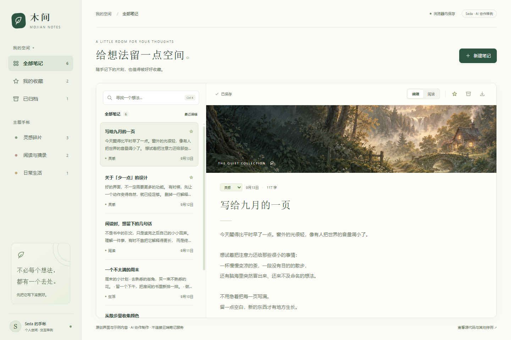

# Mojian / 木间

A new, original notes-interface study with working interactions and browser
storage. Created with AI assistance for Seda's public portfolio; it is a
demonstration rather than a past client project.

[Open the interactive sample](https://449693691.github.io/quickfix-desk-demos/).

Use the language selector for English or Chinese, or open the
[English interface](https://449693691.github.io/quickfix-desk-demos/?lang=en) /
[中文界面](https://449693691.github.io/quickfix-desk-demos/?lang=zh) directly.
The selector remembers your choice. A fresh workspace has sample notes in the
initial language; existing notes stay as written when the interface changes.



[English desktop preview](preview-desktop-en.png) · [English narrow preview](preview-mobile-en.png)

The interface supports creating and editing notes, searching title/body text,
favorites, topic filters, archive/undo, a reading view, and plain-text export.
Notes stay in the current browser's local storage. The sample has no cloud
account or synchronization service.

Built with HTML, CSS, JavaScript and inline SVG icons. The forest illustration
was AI-generated for the original [Quiet Light study](../atmospheric-video-demo/README.md)
and reused here. No third-party script or font is loaded by the page.

## Try locally

Serve this directory with any static web server, for example:

```sh
python -m http.server 8000 --bind 127.0.0.1 --directory docs
```

Then open `http://localhost:8000`. Use sample text when exploring the demo.
Browser storage is local to the browser and site address; exporting a note
creates a plain-text file you can keep independently.

## Verification

Checked in the installed Chrome browser at 1440×960 and 390×844:

- Created a note and edited its title and multiline body; both survived reload.
- Searched body text, displayed an empty result, and cleared the search.
- Added and removed favorites, including removing the selected item while
  viewing the favorites list.
- Archived a note, restored it, and used undo during the visible prompt.
- Exported a note and verified the downloaded title and complete body.
- Displayed HTML-like input as literal text in the reading view.
- Changed a topic from a filtered view and returned from the narrow editor
  to the selected note button, without focusing the search keyboard.
- Checked horizontal overflow, text-area clipping, image load state and
  browser console messages. The final checks showed no overflow/clipping
  and no console warnings or errors.

This is a Chrome viewport and interaction check. Physical-device testing,
screen-reader testing and a full accessibility audit have not been performed.

The English/Chinese update was additionally checked at both viewport sizes:

- An edited mixed-language title, multiline body and topic survived a language
  switch and reload; the complete saved-notes JSON was unchanged.
- Topic values remained compatible with existing saved notes while their
  displayed labels, dates, character count and action labels changed language.
- Reading mode remained active across a language switch, displaying HTML-like
  input as literal text.
- English search empty states, archive/undo and the real text download were
  exercised. An untitled note exported as `Untitled note.txt`, with the complete
  expected Unicode body verified from the downloaded file.
- A stored English preference survived navigation to the plain URL. With that
  preference removed, the Chinese browser default selected Chinese and Chinese
  sample notes. Explicit English links selected English.
- Clean English list/editor layouts had no horizontal overflow, title clipping
  or text-area clipping, and Chrome reported zero errors or warnings.

[Narrow layout preview](preview-mobile.png)

Code license: MIT, as with the repository's other demonstration code.
